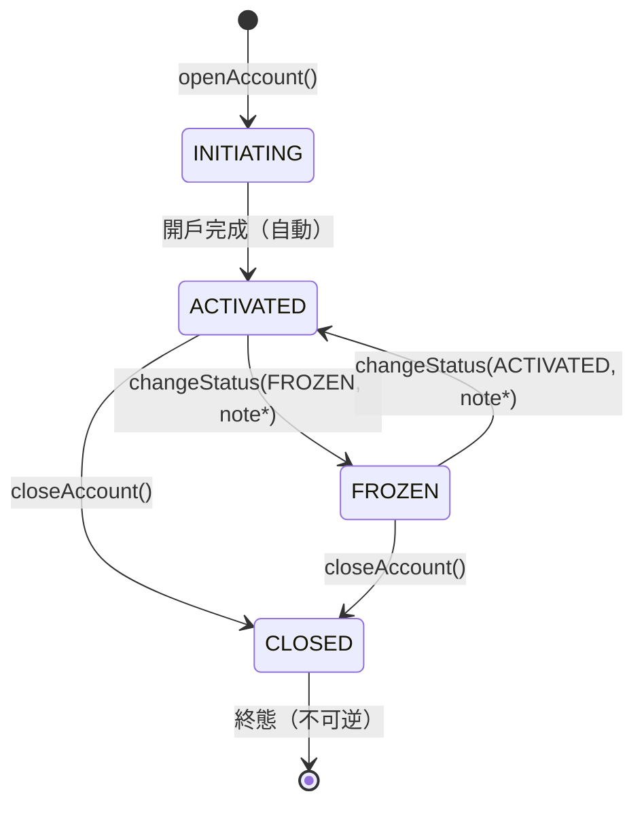
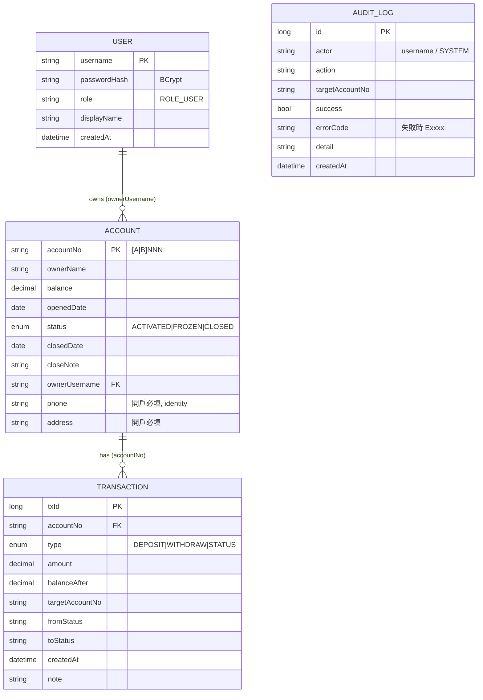
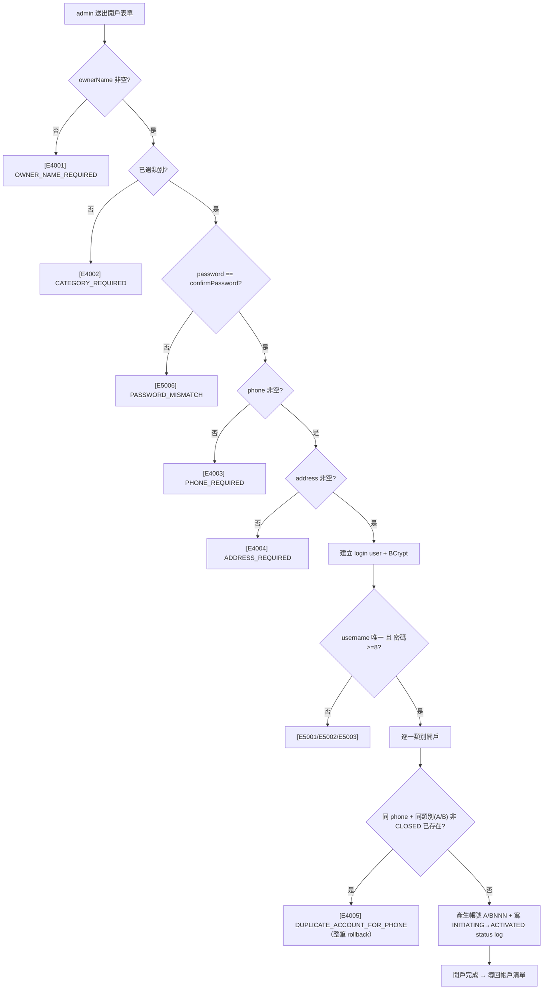
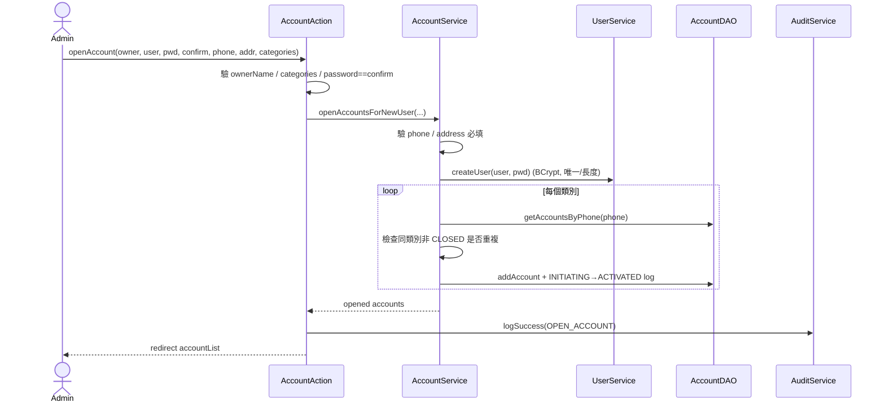
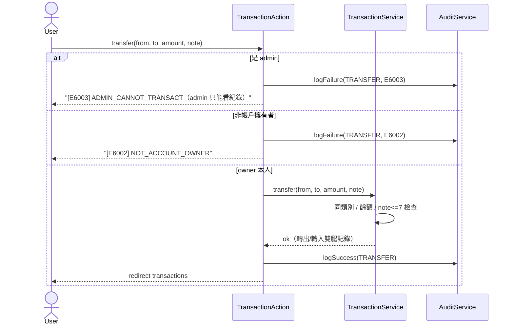
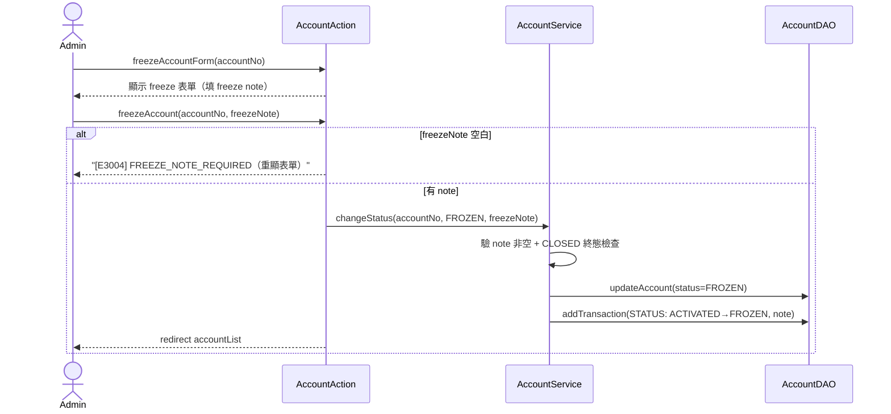

# Design — Account Management (Legacy)

## 1. 架構概覽

```
Browser → Embedded Tomcat 7 (port 8080)
         ├─ Spring Security Filter (login/logout)
         ├─ Struts2 Filter (*.action routing)
         │   ├─ AccountAction (CRUD + lifecycle)
         │   └─ TransactionAction (deposit/withdraw/transfer)
         ├─ Spring 4 DI (XML beans)
         │   ├─ AccountServiceImpl
         │   └─ TransactionServiceImpl
         ├─ Hibernate 4 SessionFactory
         │   ├─ AccountDAOImpl
         │   └─ TransactionDAOImpl
         └─ MySQL (Docker: accountdb-mysql)
```

## 2. 領域模型

### Account

| 欄位 | 型別 | 說明 |
|:---|:---|:---|
| accountNo | VARCHAR(20) PK | 格式 `[A|B]NNN`，A=台幣 B=外幣，自動累進 |
| ownerName | VARCHAR(100) | 戶名 |
| balance | DECIMAL(19,2) | 帳戶餘額 |
| openedDate | DATE | 開戶日（自動設定） |
| status | ENUM(ACTIVATED/FROZEN/CLOSED) | 帳戶狀態 |
| closedDate | DATE | 關戶日 |
| closeNote | VARCHAR(255) | 關戶註記 |
| ownerUsername | VARCHAR(50) FK→users | 擁有者登入帳號（#7 過濾依據） |
| phone | VARCHAR(30) | 聯絡電話（開戶必填；電話為 identity，見 3.8） |
| address | VARCHAR(255) | 聯絡地址（開戶必填） |

### Transaction

| 欄位 | 型別 | 說明 |
|:---|:---|:---|
| txId | BIGINT PK AUTO_INCREMENT | 交易序號 |
| accountNo | VARCHAR(20) FK | 所屬帳號 |
| type | ENUM(DEPOSIT/WITHDRAW/STATUS) | 交易類型 |
| amount | DECIMAL(19,2) | 金額（STATUS 為 0） |
| balanceAfter | DECIMAL(19,2) | 交易後餘額 |
| targetAccountNo | VARCHAR(20) | 轉帳目標帳號 |
| fromStatus | VARCHAR(10) | 狀態變更前 |
| toStatus | VARCHAR(10) | 狀態變更後 |
| createdAt | DATETIME | 建立時間 |
| note | VARCHAR(255) | 備註 |

### AccountCategory

| 值 | 前綴 | 說明 |
|:---|:---|:---|
| TWD | A | 台幣帳戶 |
| FOREIGN | B | 外幣帳戶 |

### User（系統登入使用者，#6）

| 欄位 | 型別 | 說明 |
|:---|:---|:---|
| username | VARCHAR(50) PK | 登入帳號 |
| passwordHash | VARCHAR(100) | BCrypt 雜湊（不存明文） |
| role | VARCHAR(20) | ROLE_USER（DB 客戶皆此；admin 走 in-memory 不入表） |
| displayName | VARCHAR(100) | 顯示名稱（= owner 姓名） |
| createdAt | DATETIME | 建立時間 |

### AuditLog（稽核紀錄，#9）

| 欄位 | 型別 | 說明 |
|:---|:---|:---|
| id | BIGINT PK AUTO_INCREMENT | 序號 |
| actor | VARCHAR(50) | 操作者 username（admin / 客戶 / SYSTEM） |
| action | VARCHAR(30) | OPEN_ACCOUNT/DEPOSIT/WITHDRAW/TRANSFER/FREEZE/ACTIVATE/CLOSE/UPDATE_OWNER/CHANGE_PASSWORD |
| targetAccountNo | VARCHAR(20) | 操作對象帳號（可 null） |
| success | TINYINT(1) | 成功與否 |
| errorCode | VARCHAR(10) | 失敗時的錯誤碼（成功為 null） |
| detail | VARCHAR(500) | 人類可讀細節 |
| createdAt | DATETIME | 時間 |

## 3. 關鍵設計決策

### 3.0 帳戶狀態 State Machine

DB 只存穩態（ACTIVATED / FROZEN / CLOSED）；過渡態（INITIATING / UNFREEZING / CLOSING）僅存在於 status change log 的 transition 記錄中。



**狀態說明**：

| 狀態 | DB 儲存 | 說明 |
|:---|:---|:---|
| INITIATING | 否（log only） | 開戶中（概念態，瞬間完成） |
| ACTIVATED | 是 | 正常運作，可交易 |
| FROZEN | 是 | 已凍結，不可交易但可解凍/關戶 |
| CLOSED | 是 | 終態，不可逆 |

**狀態變更 log 格式**：每次 transition 寫一筆 `type=STATUS` 的 Transaction，帶 `fromStatus` → `toStatus`。

| 場景 | from_status | to_status | note |
|:---|:---|:---|:---|
| 開戶 | NULL（INITIATING） | ACTIVATED | INITIATING -> ACTIVATED: Account opened |
| 凍結 | ACTIVATED | FROZEN | ACTIVATED -> FROZEN: {freezeNote}（note* 必填，item2） |
| 解凍 | FROZEN | ACTIVATED | FROZEN -> ACTIVATED: {activateNote}（note* 必填，本輪） |
| 關戶 | ACTIVATED/FROZEN | CLOSED | {from} -> CLOSED: {closeNote} |

### 3.1 帳號自動累進

- 開戶時 client 只選類別（可多選），server 查 `MAX(SUBSTRING(account_no, 2))` + 1 產生帳號
- 帳號範圍 001~999；overflow 拋 exception

### 3.2 同類別轉帳限制

- 轉帳前比對 `from.accountNo.charAt(0) == to.accountNo.charAt(0)`
- 不符合拋 `IllegalArgumentException("Cross-category transfer not allowed")`

### 3.3 批次關戶

- `closeAccounts(List<String> accountNos, String note)` 逐一呼叫 `closeAccount`
- 部分失敗不影響其他帳戶，回傳 `List<CloseAccountResult>`（成功/失敗+原因）

### 3.4 History 分類顯示

- JSP 以 `type != 'STATUS'` / `type == 'STATUS'` 分成兩個表格
- Transaction History：txId / type / amount / balanceAfter / targetAccountNo / note / createdAt
- Status Change History：txId / fromStatus / toStatus / note / createdAt

### 3.5 認證與授權（#6/#7/#8）

**認證（雙 provider）**：
- admin：`SecurityConfig` in-memory，帳密走環境變數 `ADMIN_USERNAME`/`ADMIN_PASSWORD`，角色 `ROLE_ADMIN`
- 一般客戶：`CustomUserDetailsService` 從 users 表載入，BCrypt 比對，角色 `ROLE_USER`

**授權雙層防護**：
1. URL 層（`SecurityConfig.authorizeRequests`）：
   - admin-only：openAccount / addAccount / freeze / activate / close* / freezeSelected / activateSelected / editOwnerForm / updateOwner / resetPasswordForm / resetPassword / auditLog（`hasRole("ADMIN")`）。
   - 已登入即可：accountList / transactions / **deposit / withdraw** / transfer / changePassword（deposit/withdraw 為帳戶擁有者自助，非 admin 專屬）。
   - 用 `/name*` 一併涵蓋 `/name` 與 `/name.action`。
2. Action / service 層授權（item1）：
   - **admin 只能看紀錄，不可代做交易**：deposit / withdraw / transfer 一律先擋 admin，拋 `[E6003] ADMIN_CANNOT_TRANSACT`（transactionList.jsp 對 admin 也隱藏交易表單，只顯示 view-only 提示）。
   - 一般 user 對帳戶的檢視 / 存款 / 提款 / 轉出，驗證 `account.ownerUsername == 當前登入者`，否則拋 `[E6002] NOT_ACCOUNT_OWNER`。防止直接 POST 繞過 UI。
   - 交易查詢（transactions.list）admin 可看全部、user 只看自己名下（admin 檢視不受 item1 限制）。

**帳戶 ↔ 使用者**：一個 owner 一個登入帳號（`openAccountsForNewUser` 於同一交易建立 user + 開戶並 stamp ownerUsername，原子性）。accountList 依角色決定 `getAllAccounts()` 或 `getAccountsByOwner(username)`。

**owner name 中央化（item3）**：owner 顯示名稱以 `User.displayName` 為單一真相；`Account` 以唯讀 `@ManyToOne owner`（join owner_username、insertable/updatable=false、EAGER）取得，`getOwnerDisplayName()` 優先回 `owner.displayName`（fallback `ownerName`）。admin 改名走 `UserService.updateDisplayName`（改 User，一改全帳戶同步）；user 不可改名。

**user 頁面（item2）**：一般 user 的帳戶清單無 Actions 欄（唯一自助操作＝改密碼，在 header）；存 / 提 / 轉在交易頁。

**admin 中央管理（item3/item4）**：`editOwnerForm`/`updateOwner`（改 User.displayName）、`resetPasswordForm`/`resetPassword`（`UserService.adminSetPassword`，無需舊密碼）。

**批次狀態（item7）**：`AccountService.changeStatusBatch(nos, status, note)` 支援批次 freeze / activate，與既有批次 close 並列，逐筆回報成功/失敗。批次凍結先進 `batchFreezeForm` 填 freeze note（未填回 `[E3004]`）、批次解凍先進 `batchActivateForm` 填 activate note（未填回 `[E3005]`），note 套用到每一筆。

**狀態變更註記（item2 + 本輪）**：`changeStatus(no, status, note)` 的 note 一律必填——凍結為 freeze note（單筆 `freezeAccountForm`→`freezeAccount`、批次 `batchFreezeForm`→`freezeSelected`，空白回 `[E3004]`）；解凍為 activate note（單筆 `activateAccountForm`→`activateAccount`、批次 `batchActivateForm`→`activateSelected`，空白回 `[E3005] ACTIVATE_NOTE_REQUIRED`）。note 寫入 STATUS 交易 log。

### 3.5b 密碼二次確認 / 開戶聯絡資料 / 電話唯一性（本輪）

- **密碼二次確認**：開戶（`password`/`confirmPassword`）、自助改密（`newPassword`/`confirmNewPassword`）、admin 重設密碼皆於 Action 層比對兩次輸入，不一致回 `[E5006] PASSWORD_MISMATCH`（不進 service）。
- **開戶聯絡資料必填**：`openAccountsForNewUser` 於 service 層驗 `phone` / `address` 非空，空白分別回 `[E4003] PHONE_REQUIRED` / `[E4004] ADDRESS_REQUIRED`。
- **電話唯一性（#5）**：電話為 identity。開戶前以 `AccountDAO.getAccountsByPhone(phone)` 查同電話帳戶，若已存在**同類別（同帳號前綴 A/B）且非 CLOSED** 者，拒絕並回 `[E4005] DUPLICATE_ACCOUNT_FOR_PHONE`。允許一人 1 台幣 + 1 外幣；關戶（CLOSED）後可重開同類別。
- **Edit owner 聯絡資料同步**：`AccountService.updateContactForOwner(username, phone, address)` 更新該 user 名下**所有帳戶**的 phone / address（電話 identity 一致性）；admin 的 editOwner 表單同時可改 displayName + phone/address + 選填新密碼。

### 3.6 錯誤碼體系（#5）

- `BankErrorCode` enum（`Exxxx`）＋ `CodedException` 介面。
- `BankValidationException extends IllegalArgumentException`、`BankStateException extends IllegalStateException`、`InsufficientBalanceException` 皆 implements `CodedException`——**刻意用 IS-A 保住既有測試的 expected exception 型別**，同時攜帶錯誤碼。
- 訊息統一 `[Exxxx] message`；Action catch 後 `addActionError(ex.getMessage())` 直接帶碼顯示，並用 `CodedException.codeOf(ex)` 取碼寫稽核。

### 3.7 稽核（#9）

- 獨立 `audit_log` 表（與 transactions 業務紀錄分離），記錄 who / what / target / success / errorCode。
- 由 Action 層呼叫 `AuditService.logSuccess/logFailure`（actor 取自 `SecurityUtil.currentUsername()`）；成功與失敗都記。
- admin 專屬 `/auditLog` 頁，過濾（item6）：結構化條件（actor / action / target / success / **errorCode** / date range）以 HQL 於 DB 執行；**detail 查詢**（純文字 contains 或 **regex**）因 HQL 無 REGEXP 改在 Java 端過濾（audit_log 資料量小，成本可接受）。regex 語法錯誤回 `[E7001]`。
- id 與時間同序（item5）：golden seed 以單一 INSERT 依 created_at 升序，AUTO_INCREMENT 主鍵順序即時間順序。
- **profile 變更 detail 格式（本輪）**：owner name / 密碼 / 電話 / 地址 變更的 audit detail 一律為 `user=<對象> changed: <實際變更欄位清單>`（`UserAction.describeOwnerChanges` 比對舊值只列真的有變更的欄位）；失敗事件為 `user=<對象> change failed (attempted: <欄位>): <訊息>`。密碼變更區分 `(self)` 與 `(admin reset)`。**不再寫籠統的「name/phone/address updated」**。
- **排序（本輪）**：`auditLog` 頁支援 sort-by 下拉 + 點欄位標題排序（`AuditAction.applySort` 於 Java 端依 id/createdAt/actor/action/targetAccountNo/success/errorCode 排序；JSP 以 `setSort(col)` 沿用當前過濾條件，第一次 ASC、再次同欄位切 DESC）。

## 4. 技術棧

| 層 | 技術 |
|:---|:---|
| Web | Struts 2.5 + JSP |
| UI Layout | Sticky header（`header.jsp` include）+ main-content scroll |
| DI | Spring 4.3 (XML) |
| Security | Spring Security 4 |
| ORM | Hibernate 4 + MySQL |
| Build | Maven / Embedded Tomcat 7 |
| Runtime | JDK 17（`--add-opens` 相容） |

### UI 結構

```
┌──────────────────────────────────────────────────────────────┐
│ [ABC Logo]  AnyCompany Business Capital (ABC)  admin [Logout] │  ← sticky header (header.jsp)
├──────────────────────────────────────────────────────────────┤
│                                                     │
│  (main-content: accountList / transactions / etc.)  │  ← scrollable content
│                                                     │
└─────────────────────────────────────────────────────┘
```

- 品牌：**AnyCompany Business Capital (ABC)** + `abc-logo.svg`（舊 AWS logo 保留於 images/ 未刪）
- Actions 欄：admin 帳戶清單的每列操作改為 `<select onchange>` 下拉選單（Edit Owner / Freeze / Activate / Close）
- `header.jsp`：共用 include，顯示 logo / app name / 登入帳戶 / logout
- 各頁面用 `<jsp:include page="header.jsp"/>` 引入
- CSS class: `.app-header`（position:sticky）+ `.main-content`（padding）

## 5. Golden Baseline（出廠資料，item8 擴充）

- **時間軸**：所有 golden timestamp 落在 **2026 年且不晚於 6/30**（月序 2026-01 … 2026-06），id 與時間同序
- **聯絡資料**：每位 user 有唯一電話（alice 0911 / bob 0922 / carol 0933 / david 0944 / eve 0955 / frank 0966）+ 地址；同 user 名下帳戶共用同電話（電話 identity）
- 使用者 6 筆（DB 客戶，皆 ROLE_USER，密碼 `user1234`）：alice / bob / carol / david / eve / frank；admin 走 in-memory 不在 users 表
- 帳戶 9 筆，皆有 owner_username + phone + address（含 1 個 CLOSED 範例 A006）：
  A001(alice) 850.00、A002(bob) 950.50、A003(carol) 0.00 FROZEN、A004(david) 12345.67、
  A005(eve) 2200.00、A006(frank) 0.00 CLOSED、B001(alice) 4700.00、B002(bob) 2300.00、B003(eve) 1000.00
- 交易 42 筆：deposit / withdraw / **3 組轉帳配對兩腿**（A001→A002 rent、B001→B002 fx、A005→A002 salary）+ 狀態變更（含 freeze/activate/close）+ 一批 6/30 的額外收付紀錄（豐富 transaction history，各帳戶淨額為零、餘額不變）
- audit_log 40 筆：多種 action（OPEN/DEPOSIT/WITHDRAW/TRANSFER/FREEZE/ACTIVATE/CLOSE/UPDATE_OWNER/CHANGE_PASSWORD）+ 5 種失敗錯誤碼（E2001/E2004/E1002/E5003/E6003）+ 豐富的 profile 變更歷史（alice 有 phone/address/密碼多筆，bob/eve 亦有）
- id 與時間同序（item5）：transactions / audit_log 皆以單一 INSERT 依 created_at 升序
- `./run.sh db-reset` 可還原

## 6. 帳號密碼（golden）

| 角色 | 帳號 | 密碼 | 可見帳戶 |
|:---|:---|:---|:---|
| ADMIN | admin | 見 `.env`（`ADMIN_PASSWORD`） | 全部 |
| USER | alice | user1234 | A001, B001 |
| USER | bob | user1234 | A002, B002 |
| USER | carol | user1234 | A003 |
| USER | david | user1234 | A004 |
| USER | eve | user1234 | A005, B003 |
| USER | frank | user1234 | A006（CLOSED） |

## 7. 主場景圖（Diagrams）

> 帳戶狀態機（State Machine）見 §3.0；本節補齊帳戶建立流程、主場景 sequence 與 ER diagram。

### 7.1 ER Diagram（領域模型關聯）



> `AUDIT_LOG` 與業務表分離（獨立稽核），`actor` / `targetAccountNo` 為弱關聯（不設 FK 約束），以便記錄失敗事件與非帳戶對象。

### 7.2 帳戶建立流程（含電話檢查）



> 全流程同一交易（原子）：任一步失敗（含電話重複）整筆 rollback，不留孤兒 user。

### 7.3 Sequence：開戶（openAccountsForNewUser）



### 7.4 Sequence：轉帳（含 admin 擋 + ownership）



> 存款 / 提款 sequence 同構：admin → `[E6003]`；非 owner → `[E6002]`；owner 本人 → 執行 + 寫 audit。

### 7.5 Sequence：凍結（含 freeze note，item2）



> 解凍（activate）流程與 §7.5 同構：`activateAccountForm`→`activateAccount`（單筆）/ `batchActivateForm`→`activateSelected`（批次），activate note 空白回 `[E3005] ACTIVATE_NOTE_REQUIRED`。

### 7.6 UI 欄位命名（本輪）

交易頁（transactionList.jsp）兩個歷史表的註記欄位名稱明確化：

| 表 | 欄位 | 說明 |
|:---|:---|:---|
| Transaction History | **Transaction Note** | 金額交易（存/提/轉）的註記（原「Note」） |
| Status Change History | **Status Note** | 狀態變更（freeze/activate/close）的 note（原「Note」） |

轉帳表單的註記輸入亦標為 **Transaction Note**（≤ 7 字元）。

### 7.7 清單導覽與 Profile 變更歷史（本輪）

**帳戶清單導覽（accountList.jsp）**：
- 點擊「帳號」→ `transactions?accountNo=X`（進入該帳戶交易畫面）。
- 點擊「owner name」→ `editOwnerForm?targetUsername=X`（進入帳號編輯畫面）。此連結僅對 admin 顯示（editOwnerForm 為 admin 專屬 URL）；一般 user 顯示純文字。

**Profile 變更歷史（就地呈現）**：
- owner name / 密碼 / 電話 / 地址 變更皆寫 audit（`UPDATE_OWNER`、`CHANGE_PASSWORD`；detail 內含 `user=<username>` 以利依使用者過濾）。
- `AuditService.profileChangeHistory(username)` 撈該使用者的 `UPDATE_OWNER` + `CHANGE_PASSWORD` 紀錄（新到舊），由 `editOwnerForm` 載入，於 Edit Owner 頁面下方表格就地呈現。
- 設計取捨：**就地面板（in-context）+ 保留全站 Audit Log 頁**。就地面板讓 admin 在編輯當下即看到該使用者「改過什麼」，是最高價值的視圖；全站 `auditLog` 頁仍是完整稽核 firehose。兩者共用同一 `audit_log` 資料，不重複儲存。

**golden 時間軸**：所有 golden 時間不晚於 2026-06-30（本輪要求），維持 id 與時間同序。
